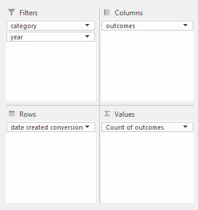
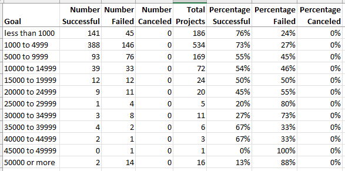
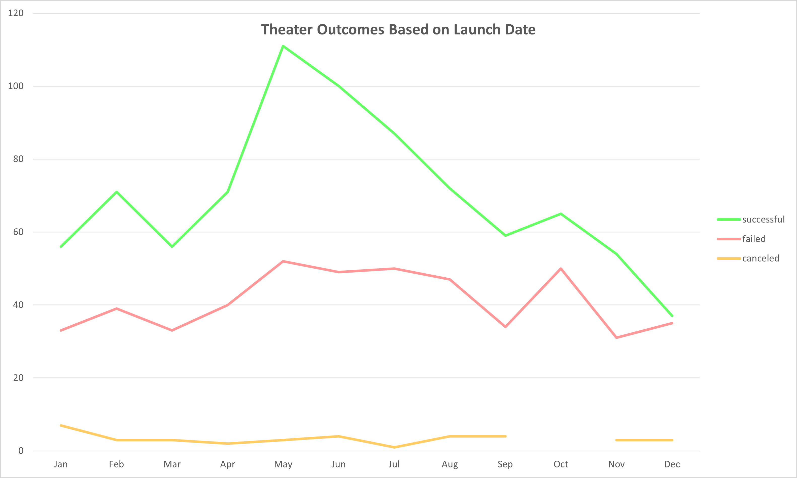
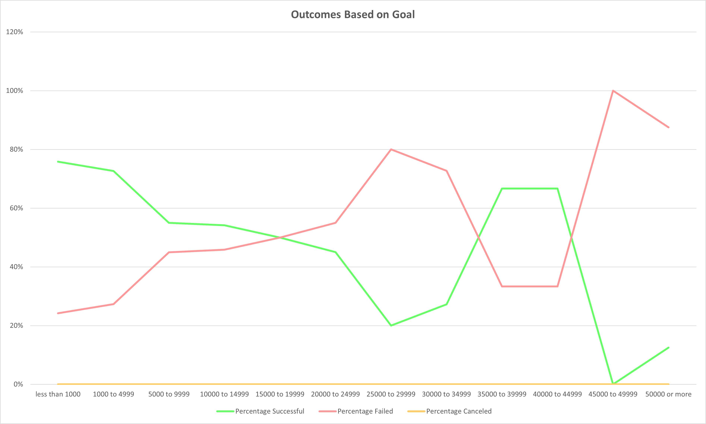

# Kickstarting with Excel

## Overview of Project
Based on data from more than four thousand Kickstarter campaigns, narrow the focus to those most relevant to a theater production and analyze their outcomes based on variables that can be controlled.

### Purpose
Determine how different campaigns tend to fare in relation to their launch dates and funding goals in order to help determine how much to ask for in a new theatrical venture and also to decide when would be a good time to launch.

## Analysis and Challenges
Curated the [Kickstarter data](resources/Kickstarter_Challenge.xlsx) into two, more narrowly focused subsets of data, each relevant to a single variable relationship—specifically, theater outcomes based on launch date and theater outcomes based on funding goals.

For each of those data subsets, created a line graph to illustrate how theater Kickstarters might succeed or fail based on the aforementioned criteria.

### Analysis of Outcomes Based on Launch Date
In this section, the focus of the Kickstarter data was narrowed using a pivot table. The table was given filters based on the category of the Kickstarter—which, in this case, was set to 'theater'—and on the year of the Kickstarter's launch date. The rows of the table were set to show the launch date months—attained from the 'date created conversion' column—and the columns were set to show the outcomes of the Kickstarters (whether successful, failed, or canceled). The cells within the table were set to count the number of Kickstarters that matched that cell's row and column criteria.

Inspection of the monthly outcomes shows that each month had roughly 100 Kickstarter attempts made (with December having the fewest, at 75, and May having the most, at 166).

A visual summary of the pivot data was then created by generating a [line graph](resources/Theater_Outcomes_vs_Launch.png) (note the hyperlink) using Excel's PivotChart feature. (The graph, itself, appears below in the Results section.)

### Analysis of Outcomes Based on Goals
In this section, the focus of the Kickstarter data was narrowed by calculating specific values from the main data using Excel formulas.

Pledge-goal-value "bins" were created, with each spanning roughly 5000 units. (The two lowest and the highest bins deviate from this scheme, spanning 1000, 4000, and infinite units, respectively.) These bins would serve as the rows of the table. (Note that the pledge goal currency units vary in the source data.) The table was then given columns to represent the number of successful, failed, and canceled Kickstarters.

The interior of the table was populated by counting the number of Kickstarters with subcategory type 'plays' whose goal values correspond with that row's respective bin and whose outcomes correspond with that column's respective outcome.

Additional columns were then added to calculate 'Total Projects' (a simple sum of all plays in that row's bin) and the percentage of successful, failed, and canceled Kickstarters whose goals match a given row's bin values (calculated by dividing the number of relevant projects by the number of total projects matching that row's bin).

Inspection of table shows that there are a relatively large number (800+) of Kickstarter plays with low-value goals (below 10,000 units), with the numbers dropping of significantly (158 plays, in total) at goals of 10000 or more. Additionally, out of more than 1,000 plays in the data set, **none** had a canceled outcome.

A visual summary of the table data was then created by generating a [line graph](resources/Outcomes_vs_Goals.png) (note hyperlink) using Excel. The graph shows the percentage of plays that succeeded, failed, or were canceled relative to each goal-value bin (and can be seen, below, in the Results section).

Note that the line for canceled plays lies flat across the bottom (due to there being no canceled plays, as noted, above), and that the graphs for successful and failed plays are symmetric about the 50% line. (This is a natural outcome of there being only two outcomes with non-zero values and of the proportions always totaling 100%.)

### Challenges and Difficulties Encountered
Each analysis presented different challenges. Details are presented, below.

#### For Outcomes Based on Launch Date
The pivot table required a filter based on the year of the productions' launch dates, but the dates in the original data were in full-date formats. This required the creation of an additional, calculated column to extract the year from those full dates.

In addition, pulling the 'date created conversion' column into the Rows section of the pivot table also caused Excel to create 'Quarters' and 'Years' for those dates, which were not relevant to the analysis, and so required manual removal.

It was also desired that the Kickstarter outcomes would be listed as 'successful', 'failed', and 'canceled'—in that order—but the default sort order was (apparently) alphabetical, and so the columns also had to be manually re-ordered. (Live outcomes were not relevant to the analysis, and were simply filtered out.)

When creating the line chart, itself, Excel includes filter buttons and drop-down menus in the chart area by default. These had to be hidden (by clicking on the chart, and then selecting PivotChart Analyze > Show/Hide > Field Buttons > Hide All) before saving the chart image.

#### For Outcomes Based on Goals
All entries in the table are—whether directly or indirectly—based on the upper and lower limits of the bins that correspond to their rows. However, the row labels are formatted as text, which cannot be used in most arithmetic operations. So two additional "helper" columns were created and then hidden—but which could still be used in calculations—in order to make the calculations more consistent and less prone to transcription errors. (The irregularity of the bin widths—as noted in the Analysis of Outcomes section, above—still required manual adjustment for the lowest- and highest-valued bins, but the majority of table entry could otherwise be automated by copying Excel formulas with appropriately relative cell addresses.)

When creating the line chart, itself, Excel originally included a line for each column in the table, but only the percentage columns were desired. These other columns had to be removed (by clicking on the chart, and then selecting Chart Design > Data > Select Data, and then selecting and removing the unwanted series from the Legend Entries pane) before saving the chart image.

## Results
The data seeks to answer the following questions:
- What are two conclusions you can draw about the Outcomes based on Launch Date?
- What can you conclude about the Outcomes based on Goals?
- What are some limitations of this dataset?
- What are some other possible tables and/or graphs that we could create?

Despite their simple appearance, the answers to these questions are complex, and will be addressed below.

### Outcomes Based on Launch Date
Looking at the graph of Theater Outcomes based on Launch Date:

#### Apparent Conclusions
It appears, at first glance, as if:
- Theater productions that launch in late spring and early summer succeed more than those that launch at other times (as evidenced by the height of the "successful" line in those months).
- Launch date has little bearing on a theater production's failure (as evidenced by the relatively flat "failure" line).

However, when we look at the data that generated these lines, we find…

#### Problems
An examination of the pivot table that generated the lines in the graph shows that the months that have higher successful counts also have higher numbers of theater productions, overall. As such, if the goal of the analysis is to determine the chance of success or failure of a production that launches at a given time of year, the graph is misleading because it hides any increases or decreases that are simply the result of proportional changes in the number of theater productions, overall.

##### How to Make it Better
A more effective presentation would be to plot the proportional rates of success and failure by launch date month (in a manner similar to the analysis of outcomes based on goals).

### Outcomes Based on Goal
Shifting focus to the graph of Outcomes Based on Goal:

#### Apparent Conclusions
The graph seems to indicate that the success rate of plays decreases with its funding goal values up to a point, but that there's an oasis of "sweet-spot" funding goal values somewhere in the 35000 to 45000 unit range where plays are as- or nearly as successful as those with low goals.

#### Problems
Many features of the graph are irrelevant, redundant, or misrepresent the source data.
- There are no canceled plays in the data set. So there's no reason to plot results for them on the graph.
- Because there are no canceled plays, the remaining plays *all* fall into only two categories: successful and failed. Given that the graph plots proportional results, no additional information is gained by presenting both series because each is just a reflection of the other about the 50% line.
- Use of a line graph subtly implies that the horizontal axis represents data whose values are very finely separated—possibly even continuous. The "bins" (the ranges of goal values that make up the horizontal axis) used in this graph, however, separate the goal values into very coarsely separated, discrete partitions.

The table from which the graph is generated is also riddled with problems:
- The bins differ in width. Most of the bins have a 5,000-unit width, but the first two bins have 1,000- and 4,000-unit widths, respectively, and the last bin is, technically, infinitely wide. Given that the maximum goal value in the data set is 200,000, however, it might be more honest to say that the bin has a width of 150,000. Given that the graph represents proportions, and not total numbers, in each of these bins, this causes the graph to give outsized weight to entries in bins with few entries.
- The currency units used in the goals data are not normalized. Most of the currency is in USD, but several are not. There are, for example, entries for Euros (Ireland), pounds (GB/UK), and krona (Sweden). Although data from the 2011–2015 time period was unavailable, as of the time of this writing (April 2022), each Swedish krona (SEK) was worth only about 0.1 US dollars (USD). (Source: [Oanda Currency Converter](https://www.oanda.com/currency-converter/en/?from=SEK&to=USD&amount=1).)
- Low-goal plays are far, far more frequent than high-goal plays. (See the "Analysis of Outcomes Based on Goals" section, above.) For some statistics: the goal values have a mean of 5,000 and a mean of 6,124 — a notable right skew to the data.
- Not only are there far fewer high-goal plays in the data, the absolute quantities of data at those levels renders any inferences based on them suspect simply because of their small sample sizes.
- The data is filtered to show Kickstarters whose subcategory is "plays". This is in contrast to the outcomes-based-on-launch-date data analysis (above), which was done by filtering on the category (not subcategory) "theater". If these results are intended to make inferences based on their combined data, it leads to an unreliable apples-and-oranges comparison.

##### How to Make it Better
In order to preserve the integrity of the graph's presentation, the graph's bin widths need to be the same across its entirety. Also, the 5,000-unit-wide bins hide too much information. Narrower width bins will better show the results.

If we create new, 1,000-unit wide bins for the goal data, we find the following counts in the first eleven bins: 192, 182, 180, 132, 45, 100, 20, 18, 21, 10, 54. Beyond that only two of these new bins contain counts above 20, and most have none at all. These small sample sizes of Kickstarters with goal values over about 11,000 make any inferences based on their data unreliable, and they should therefore be discarded unless a compelling reason can be given for their inclusion.

Because the "Percentage Canceled" series is irrelevant, it should be removed. The graph should then be re-created in "stacked-column" style (instead of as a line graph), which will better show the proportional relationships between "Percentage Successful" and "Percentage Failed" within each bin, and better imply the discreet character of the bins, themselves.

The currency for each Kickstarter should be converted (ideally with a date-based currency converter that can give historical exchange rates) to a common currency. It really doesn't matter which, as long as they're all converted to the same one, but since most of the data is in USD, that would be the easiest choice. By normalizing the goals to the same currency, it puts all their values on the same scale, which makes comparisons between them meaningful.

If the results are intended to be combined with the outcomes-based-on-launch-date results, they should each be filtered either to category: theater or subcategory: plays. Because the theater subcategories of "spaces" and "plays" present different challenges and raise different questions, filtering by subcategory (rather than by category) is likely the better choice.

### Conclusions
Given the many problems present both in the analyses and the presentations of the Kickstarter data, recommend sending the data back for further analysis. As-is, no conclusion derived from these analyses and presentations can be considered reliable.
